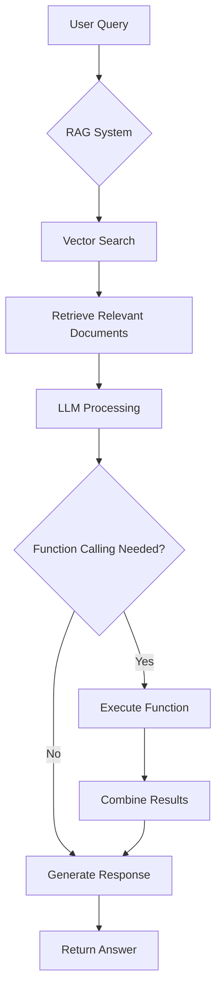

# 🌍 AI Travel Assistant with RAG System

[](https://www.python.org/downloads/)
[](https://streamlit.io/)
[](LICENSE)

Hệ thống trợ lý du lịch thông minh sử dụng **Retrieval-Augmented Generation (RAG)** với hai triển khai vector database:
- **FAISS**: Vector database cục bộ
- **Pinecone**: Vector database đám mây

## 👥 Nhóm thực hiện - Nhóm 7
- **ChauDN1** 
- **HuyTN8**
- **ThanhTP4** 
- **TuNNA**
- **HienVT9**

## 🚀 Tính năng chính

### 🔍 RAG System
- **Vector Similarity Search**: Tìm kiếm thông tin từ cơ sở tri thức
- **Conversational Memory**: Ghi nhớ lịch sử hội thoại
- **Multi-mode**: RAG Only, Functions Only, RAG + Functions

### 🛠️ Function Calling
- **Weather API**: Kiểm tra thời tiết thời gian thực
- **Hotel Booking**: Đặt phòng khách sạn (mock)
- **Attractions Search**: Tìm điểm tham quan

### 🎯 Vector Databases
- **FAISS**: Tìm kiếm vector nhanh, lưu trữ local
- **Pinecone**: Cloud vector database, scalable

### 🎨 UI Features  
- **Streamlit Interface**: Giao diện web thân thiện
- **Text-to-Speech**: Chuyển văn bản thành giọng nói
- **Real-time Chat**: Trò chuyện thời gian thực

## 🏗️ Kiến trúc hệ thống

```
📁 workshop-4/
├── 📁 faiss/                    # FAISS Implementation
│   ├── app.py                   # Streamlit App
│   ├── rag_system.py           # RAG System với FAISS
│   ├── demo.py                 # Demo script
│   ├── test_system.py          # Unit tests
│   ├── requirements.txt        # Dependencies
│   ├── destination_knowledge_extended_dataset.json
│   └── 📁 travel_faiss_index/  # FAISS index files
├── 📁 pinecone/                # Pinecone Implementation  
│   ├── app.py                  # Streamlit App
│   ├── rag_system.py          # RAG System với Pinecone
│   ├── demo.py                # Demo script
│   ├── test_system.py         # Unit tests
│   ├── requirements.txt       # Dependencies
│   └── destination_knowledge_extended_dataset.json
└── README.md
```

## 🔧 Yêu cầu hệ thống

- **Python**: 3.8 hoặc cao hơn
- **RAM**: Tối thiểu 4GB (8GB khuyên dùng)
- **Storage**: 2GB free space
- **Internet**: Cần thiết cho APIs

## 📦 Cài đặt

### 1. Clone Repository
```bash
git clone https://github.com/Elevate-AI-Room-7/workshop-4.git
cd workshop-4
```

### 2. Cài đặt FAISS Version

```bash
# Di chuyển vào thư mục FAISS
cd faiss

# Tạo virtual environment
python -m venv venv

# Kích hoạt virtual environment
# Windows:
venv\Scripts\activate
# Linux/Mac:
source venv/bin/activate

# Cài đặt dependencies
pip install -r requirements.txt
```

### 3. Cài đặt Pinecone Version

```bash
# Di chuyển vào thư mục Pinecone  
cd pinecone

# Tạo virtual environment
python -m venv venv

# Kích hoạt virtual environment
# Windows:
venv\Scripts\activate
# Linux/Mac:
source venv/bin/activate

# Cài đặt dependencies
pip install -r requirements.txt
```

## 🔑 Cấu hình Environment Variables

Tạo file `.env` trong thư mục `faiss/` và `pinecone/` (có thể copy từ `.env.example`):

```env
# Azure OpenAI Configuration
AZURE_OPENAI_API_KEY=your_azure_openai_api_key
AZURE_OPENAI_ENDPOINT=https://your-resource.openai.azure.com/
AZURE_OPENAI_MODEL=gpt-4o-mini
AZURE_OPENAI_EMBEDDING_API_KEY=your_embedding_api_key  
AZURE_OPENAI_EMBEDDING_ENDPOINT=https://your-embedding-resource.openai.azure.com/
AZURE_OPENAI_EMBED_MODEL=text-embedding-3-small

# Weather API (OpenWeatherMap)
WEATHER_API_KEY=your_weather_api_key

# Pinecone Configuration (chỉ cho pinecone version)
PINECONE_API_KEY=your_pinecone_api_key
PINECONE_INDEX_NAME=travel-chatbot-index
PINECONE_CLOUD=aws
PINECONE_REGION=us-east-1
```

### Lấy API Keys:
- **Azure OpenAI**: [Azure Portal](https://portal.azure.com/)
- **Weather API**: [OpenWeatherMap](https://openweathermap.org/api)
- **Pinecone**: [Pinecone Console](https://app.pinecone.io/)

## 🚀 Chạy ứng dụng

### FAISS Version
```bash
cd faiss
streamlit run app.py
```

### Pinecone Version  
```bash
cd pinecone
streamlit run app.py
```

Truy cập: `http://localhost:8501`

## 🧪 Chạy Tests

### FAISS Tests
```bash
cd faiss
python test_system.py
```

### Pinecone Tests
```bash
cd pinecone  
python test_system.py
```

## 🎮 Demo Scripts

### FAISS Demo
```bash
cd faiss
python demo.py
```

### Pinecone Demo
```bash
cd pinecone
python demo.py
```

## 🔄 RAG Flow



### Quy trình RAG chi tiết:

1. **Input Processing**: Nhận câu hỏi từ user
2. **Embedding**: Chuyển câu hỏi thành vector embedding
3. **Vector Search**: Tìm kiếm documents tương tự trong vector database
4. **Context Retrieval**: Lấy top-k documents liên quan nhất
5. **Prompt Construction**: Xây dựng prompt với context và câu hỏi
6. **LLM Generation**: GPT-4o-mini sinh câu trả lời
7. **Function Calling** (nếu cần): Gọi APIs bên ngoài
8. **Response Combination**: Kết hợp RAG + Function results
9. **Output**: Trả về câu trả lời cuối cùng

### 📊 RAG với Pinecone Flow:

```
User Query → Embedding Model → Pinecone Vector Search → 
Retrieve Context → LLM (GPT-4o-mini) → Response
                ↓
         Function Calling (Weather/Hotel/Attractions)
```

## 📊 So sánh FAISS vs Pinecone

| Tiêu chí | FAISS | Pinecone |
|----------|--------|-----------|
| **Deployment** | Local | Cloud |
| **Scalability** | Limited | High |
| **Setup** | Simple | Requires API key |
| **Cost** | Free | Paid service |
| **Performance** | Fast (local) | Network dependent |
| **Persistence** | File-based | Cloud-native |

## 🎯 Câu hỏi mẫu

1. **Thông tin điểm đến**: "Hà Nội có gì hay ho?"
2. **Thời tiết**: "Thời tiết Đà Nẵng hôm nay?" 
3. **Đặt khách sạn**: "Đặt khách sạn Hội An ngày 2024-12-25"
4. **Điểm tham quan**: "Điểm tham quan nổi tiếng ở Sapa?"
5. **So sánh**: "So sánh Phú Quốc và Nha Trang"

## 📄 License

MIT License - xem [LICENSE](LICENSE) file.

---

🚀 **Happy Coding!** Được phát triển bởi **Nhóm 7** cho Workshop 4.
